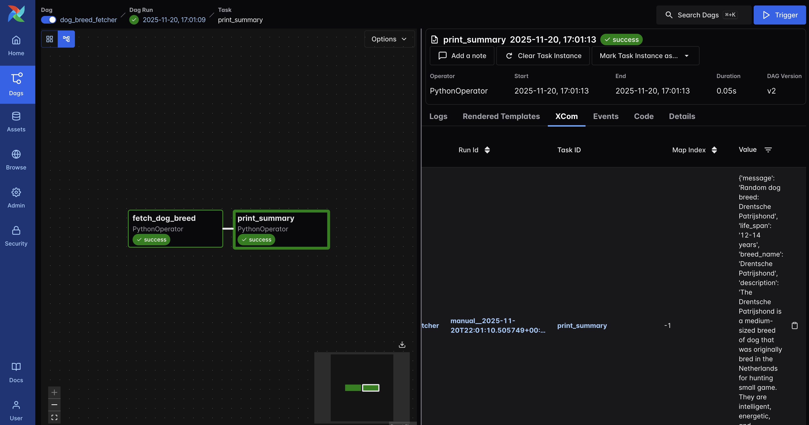
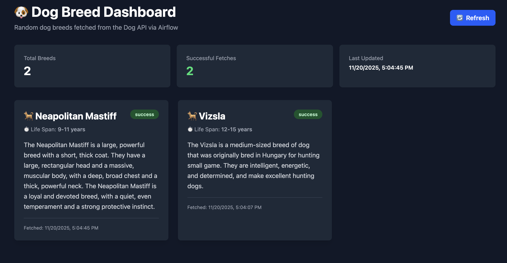

# Airflow 3.1.3 Kubernetes Setup with Dog Breeds System





This project sets up **Apache Airflow 3.1.3** on a local Kubernetes cluster using [kind](https://kind.sigs.k8s.io/) (Kubernetes in Docker) and the official [Apache Airflow Helm chart](https://airflow.apache.org/docs/helm-chart/stable/index.html).

> **Note:** This project uses Airflow 3.1.3, which includes fixes for the Security/Users page bug present in 3.0.0.

It includes a complete **Dog Breeds System** that demonstrates:
- ✅ Airflow DAG fetching data from external API
- ✅ Storing data in external PostgreSQL database (in Kubernetes)
- ✅ **Airflow Assets connected to database records** for data lineage
- ✅ FastAPI backend serving data from database
- ✅ React dashboard consuming the API
- ✅ Complete Kubernetes deployment with proper service communication

## Prerequisites

Before getting started, ensure you have the following tools installed:

- **Docker** - For running kind and containers
  - Install: [Docker Desktop](https://docs.docker.com/get-docker/) or Docker Engine
- **kubectl** - Kubernetes command-line tool
  - Install: [kubectl installation guide](https://kubernetes.io/docs/tasks/tools/)
- **kind** - Kubernetes in Docker
  - Install: `brew install kind` (macOS) or [kind installation guide](https://kind.sigs.k8s.io/docs/user/quick-start/#installation)
- **Helm 3.10+** - Kubernetes package manager
  - Install: `brew install helm` (macOS) or [Helm installation guide](https://helm.sh/docs/intro/install/)

## Quick Start

### Option 1: Complete System (Airflow + Dog Breeds)

```bash
# 1. Check prerequisites
./scripts/check-prerequisites.sh

# 2. Deploy Airflow
./scripts/start-airflow.sh

# 3. Deploy Dog Breeds System (Database + API)
./scripts/deploy-all.sh

# 4. Start Dashboard
cd dashboard
npm install
npm run dev
```

**Access Points:**
- **Airflow UI**: http://localhost:8080 (admin/admin)
- **Dog Breeds API**: http://localhost:30800
- **API Docs**: http://localhost:30800/docs
- **Dashboard**: http://localhost:5173
- **Database**: localhost:30432

### Option 2: Airflow Only

```bash
# 1. Check prerequisites
./scripts/check-prerequisites.sh

# 2. Start Airflow (all-in-one)
./scripts/start-airflow.sh

# 3. Access Airflow UI
open http://localhost:8080
```

**Default credentials:**
- Username: `admin`
- Password: `admin`

> **Note:** You can change the default credentials in `helm/values.yaml` before deployment.

## Project Structure

```
airflow/
├── dags/                       # Airflow DAG files
│   └── dog_breed_dag.py       # Dog breed fetcher DAG (stores in DB)
├── dashboard/                  # React dashboard
│   └── src/
│       ├── api.ts             # API client (connects to FastAPI)
│       └── components/        # React components
├── api/                       # FastAPI backend
│   ├── main.py               # FastAPI application
│   ├── Dockerfile            # API container image
│   └── requirements.txt      # Python dependencies
├── k8s/                       # Kubernetes manifests
│   ├── dog-breeds-db/        # PostgreSQL database
│   ├── dog-breeds-api/       # FastAPI backend
│   └── airflow/              # Generated Airflow templates (optional)
├── helm/                      # Helm values
│   └── values.yaml           # Airflow Helm configuration
├── scripts/                   # Deployment scripts
│   ├── start-airflow.sh      # Quick start Airflow
│   ├── deploy-all.sh         # Deploy complete system
│   ├── deploy-dog-breeds-db.sh   # Deploy database
│   ├── deploy-dog-breeds-api.sh  # Deploy API
│   └── ...                   # Other management scripts
└── database/                  # Database schema
    └── schema.sql            # PostgreSQL schema
```

## System Architecture

```
┌──────────────────────────────────────────────────────────────┐
│                      Kubernetes Cluster                      │
│                                                              │
│  ┌─────────────────┐                                         │
│  │ Airflow NS      │                                         │
│  │  ┌───────────┐  │                                         │
│  │  │ Scheduler │  │                                         │
│  │  │ API Server│  │───┐                                     │
│  │  │ DAG Files │  │   │                                     │
│  │  └───────────┘  │   │                                     │
│  └─────────────────┘   │                                     │
│                        │                                     │
│  ┌─────────────────────▼─────────────────┐                   │
│  │    Dog Breeds Namespace               │                   │
│  │  ┌──────────────┐   ┌──────────────┐  │                   │
│  │  │  PostgreSQL  │◄──│  FastAPI     │  │                   │
│  │  │   Database   │   │   Backend    │  │                   │
│  │  │              │   │              │  │                   │
│  │  │ Port: 5432   │   │ Port: 8000   │  │                   │
│  │  └──────────────┘   └──────────────┘  │                   │ 
│  │        │                   │          │                   │
│  └────────┼───────────────────┼──────────┘                   │
│           │                   │                              │
│    NodePort: 30432     NodePort: 30800                       │
└───────────┼───────────────────┼──────────────────────────────┘
            │                   │
            │                   │
   ┌────────▼───────┐  ┌────────▼─────────┐
   │   Database     │  │  React Dashboard │
   │   Client       │  │  (Vite + React)  │
   │   (psql)       │  │                  │
   └────────────────┘  │  Port: 5173      │
                       └──────────────────┘
```

### Data Flow

1. **Airflow DAG** fetches dog breed from Dog API every hour
2. **DAG** stores breed data in **PostgreSQL** (Kubernetes) with asset URI
3. **Airflow Asset** is created and linked to database record via `asset_uri` column
4. **FastAPI** backend queries database and serves REST API
5. **React Dashboard** displays breeds via API calls
6. **Database** accessible for direct queries and debugging
7. **Asset Lineage** tracks data from Airflow assets to database records

## Scripts Overview

The project includes several helper scripts in the `scripts/` directory. See [`scripts/README.md`](scripts/README.md) for detailed documentation.

### Quick Reference

#### Airflow Scripts
- **`start-airflow.sh`** - Complete Airflow setup
- **`deploy-airflow.sh`** - Deploy/upgrade Airflow
- **`stop-airflow.sh`** - Stop Airflow with options
- **`cleanup.sh`** - Remove everything

#### Dog Breeds System Scripts
- **`deploy-all.sh`** - Deploy database + API + configure Airflow
- **`deploy-dog-breeds-db.sh`** - Deploy PostgreSQL database
- **`deploy-dog-breeds-api.sh`** - Build and deploy FastAPI
- **`setup-airflow-db-connection.sh`** - Configure Airflow connection

#### Utility Scripts
- **`check-prerequisites.sh`** - Verify required tools
- **`setup-kind-cluster.sh`** - Create kind cluster
- **`port-forward.sh`** - Set up port forwarding
- **`status.sh`** - Check system status
- **`generate-helm-templates.sh`** - Generate K8s templates from Helm

## Manual Setup Steps

If you prefer to run steps manually:

### 1. Check Prerequisites

```bash
./scripts/check-prerequisites.sh
```

### 2. Create Kind Cluster

```bash
./scripts/setup-kind-cluster.sh
```

### 3. Deploy Airflow

```bash
./scripts/deploy-airflow.sh
```

### 4. Set Up Port Forwarding

```bash
./scripts/port-forward.sh
```

## Configuration

### Helm Values

Airflow configuration is managed through `helm/values.yaml`. Key settings include:

- **Airflow Version**: 3.1.3 (configurable)
- **Executor**: LocalExecutor (can be changed to CeleryExecutor or KubernetesExecutor)
- **Database**: PostgreSQL (managed by Helm chart)
- **Resources**: Configured for local development

To customize Airflow settings, edit `helm/values.yaml` before deployment.

### Changing Executor

To use a different executor, modify `helm/values.yaml`:

```yaml
executor: "CeleryExecutor"  # or "KubernetesExecutor"
```

For CeleryExecutor, also enable Redis:

```yaml
redis:
  enabled: true
```

### Changing Default Credentials

Edit `helm/values.yaml`:

```yaml
users:
  - username: your_username
    password: your_password
    role: Admin
```

## Dog Breeds System

### Overview

The Dog Breeds System demonstrates a complete data pipeline:

1. **Data Ingestion**: Airflow DAG fetches random dog breeds from [Dog API](https://dogapi.dog)
2. **Data Storage**: Breeds stored in PostgreSQL database running in Kubernetes
3. **Data API**: FastAPI backend provides REST API to query breeds
4. **Data Visualization**: React dashboard displays breeds in real-time

### Components

#### 1. Database (PostgreSQL)
- **Location**: `k8s/dog-breeds-db/`
- **Namespace**: `dog-breeds`
- **Service**: `dog-breeds-db.dog-breeds.svc.cluster.local:5432`
- **External Access**: `localhost:30432` (NodePort)
- **Schema**: See `database/schema.sql`

**Features:**
- UUID primary keys
- JSONB for flexible data storage
- Asset URI column linking to Airflow assets
- Indexes for performance (including asset_uri index)
- Views for common queries
- Triggers for automatic timestamps

#### 2. API Backend (FastAPI)
- **Location**: `api/`
- **Namespace**: `dog-breeds`
- **Service**: `dog-breeds-api.dog-breeds.svc.cluster.local:8000`
- **External Access**: `http://localhost:30800` (NodePort)
- **Documentation**: `http://localhost:30800/docs`

**Endpoints:**
- `GET /health` - Health check
- `GET /api/breeds` - List breeds with pagination
- `GET /api/breeds/recent` - Recent breeds (compatible with old API)
- `GET /api/breeds/stats` - Statistics
- `GET /api/breeds/{id}` - Get specific breed
- `GET /api/breeds/search/{name}` - Search by name

#### 3. Airflow DAG
- **Location**: `dags/dog_breed_dag.py`
- **Schedule**: Every hour
- **Tasks**:
  1. `fetch_dog_breed` - Fetch from API and store in database
  2. `print_summary` - Print summary (XCom usage demo)

**Database Connection:**
The DAG uses environment variables to connect:
- `DOG_BREEDS_DB_HOST`
- `DOG_BREEDS_DB_PORT`
- `DOG_BREEDS_DB_NAME`
- `DOG_BREEDS_DB_USER`
- `DOG_BREEDS_DB_PASSWORD`

**Asset-to-Database Connection:**
- Each DAG run creates an Airflow Asset with URI: `dog_breed://dog_breed_fetcher/{dag_run_id}`
- The asset URI is stored in the database `asset_uri` column
- This enables tracking data lineage from Airflow assets to database records
- Asset metadata includes database connection information for easy reference

#### 4. React Dashboard
- **Location**: `dashboard/`
- **Port**: `5173` (Vite dev server)
- **API Connection**: Configured via `VITE_DOG_BREEDS_API_URL`

**Features:**
- Real-time breed display
- Auto-refresh every 30 seconds
- Statistics dashboard
- Responsive design with Tailwind CSS

### Deployment

#### Deploy Database
```bash
./scripts/deploy-dog-breeds-db.sh
```

This creates:
- Namespace and ConfigMaps
- PostgreSQL deployment with schema
- PersistentVolumeClaim for data
- Services (ClusterIP and NodePort)

#### Deploy API
```bash
./scripts/deploy-dog-breeds-api.sh
```

This:
- Builds Docker image from `api/`
- Loads image into kind cluster
- Deploys with 2 replicas
- Creates services with health checks

#### Configure Airflow
```bash
./scripts/setup-airflow-db-connection.sh
```

This creates ConfigMaps and Secrets in Airflow namespace. Then upgrade Airflow:

```bash
helm upgrade airflow apache-airflow/airflow -n airflow -f helm/values.yaml
```

Or deploy everything at once:

```bash
./scripts/deploy-all.sh
```

### Testing the System

#### 1. Test Database Connection
```bash
# From host
psql -h localhost -p 30432 -U airflow -d dog_breeds_db

# List tables
\dt

# Query breeds with asset URIs
SELECT breed_name, asset_uri, life_expectancy, execution_date 
FROM dog_breeds 
ORDER BY execution_date DESC 
LIMIT 10;

# Query breeds by asset URI
SELECT * FROM dog_breeds WHERE asset_uri IS NOT NULL;
```

#### 2. Test API
```bash
# Health check
curl http://localhost:30800/health

# Get recent breeds
curl http://localhost:30800/api/breeds/recent?limit=5

# Get statistics
curl http://localhost:30800/api/breeds/stats

# Open API docs
open http://localhost:30800/docs
```

#### 3. Trigger DAG
```bash
# Via Airflow UI
open http://localhost:8080
# Login (admin/admin), navigate to DAGs, trigger dog_breed_fetcher

# Via CLI
kubectl exec -n airflow -it deployment/airflow-scheduler -- \
  airflow dags trigger dog_breed_fetcher
```

#### 4. View Dashboard
```bash
cd dashboard
npm install
npm run dev
open http://localhost:5173
```

### Development Workflow

#### Update API Code
```bash
# Edit api/main.py
vim api/main.py

# Rebuild and redeploy
./scripts/deploy-dog-breeds-api.sh

# View logs
kubectl logs -n dog-breeds -l component=api --tail=50 -f
```

#### Update DAG
```bash
# Edit dags/dog_breed_dag.py
vim dags/dog_breed_dag.py

# Copy updated file to pod (DAGs are in PersistentVolume)
kubectl cp dags/dog_breed_dag.py \
  $(kubectl get pods -n airflow -l component=scheduler -o name | head -1 | cut -d'/' -f2):/opt/airflow/dags/dog_breed_dag.py \
  -n airflow

# DAG processor will reload automatically (usually within 30-60 seconds)
# Check in UI or logs:
kubectl logs -n airflow -l component=dag-processor --tail=50 -f
```

#### Update Dashboard
```bash
# Edit dashboard files
cd dashboard
# Changes hot-reload automatically with Vite
```

#### Update Database Schema
```bash
# Edit database/schema.sql
vim database/schema.sql

# Update schema in running database
kubectl exec -n dog-breeds -it deployment/dog-breeds-db -- \
  psql -U airflow -d dog_breeds_db -f /docker-entrypoint-initdb.d/01-schema.sql

# Or recreate database deployment
kubectl delete deployment dog-breeds-db -n dog-breeds
./scripts/deploy-dog-breeds-db.sh
```

## Adding DAGs

Place your Airflow DAG files in the `dags/` directory. The Helm chart will automatically mount this directory into the Airflow pods.

### Option 1: Local DAGs Directory (Current Setup)

DAGs in the `dags/` directory are mounted via persistent volume. Simply add your DAG files:

```bash
# Add your DAG file
cp my_dag.py dags/
```

### Option 2: Git Sync (Advanced)

To use Git sync for DAGs, enable it in `helm/values.yaml`:

```yaml
dags:
  gitSync:
    enabled: true
    repo: https://github.com/your-org/your-dags-repo
    branch: main
    subPath: "dags"
```

## Useful Commands

### Check Status

```bash
./scripts/status.sh
```

### View Pods

```bash
kubectl get pods -n airflow
```

### View Logs

```bash
# Scheduler logs
kubectl logs -n airflow -l component=scheduler --tail=100

# API Server logs (Airflow 3 uses api-server instead of webserver)
kubectl logs -n airflow -l component=api-server --tail=100

# Specific pod logs
kubectl logs -n airflow <pod-name>
```

### Access Airflow CLI

```bash
# Execute commands in the scheduler pod
kubectl exec -n airflow -it deployment/airflow-scheduler -- airflow <command>

# Example: List DAGs
kubectl exec -n airflow -it deployment/airflow-scheduler -- airflow dags list
```

### Port Forwarding

If port forwarding stops, restart it:

```bash
./scripts/port-forward.sh
```

To stop port forwarding:

```bash
pkill -f 'kubectl.*port-forward.*airflow'
```

## Stopping Airflow

### Stop Port Forwarding Only

```bash
pkill -f 'kubectl.*port-forward.*airflow'
```

### Stop with Options

```bash
./scripts/stop-airflow.sh
```

This will prompt you to:
1. Keep deployment (just stop port forwarding)
2. Delete Airflow deployment (keep cluster)
3. Delete everything (Airflow + cluster)

## Complete Cleanup

To remove everything (Helm release, namespace, and kind cluster):

```bash
./scripts/cleanup.sh
```

**Warning:** This will delete all data and cannot be undone.

## Troubleshooting

### Airflow Issues

#### Port 8080 Already in Use
```bash
# Find the process using the port
lsof -i :8080

# Kill the process (replace PID with actual process ID)
kill -9 <PID>
```

Or change the port in `scripts/port-forward.sh`:
```bash
LOCAL_PORT=8081  # Change this
```

#### Pods Not Starting
```bash
kubectl get pods -n airflow
kubectl describe pod <pod-name> -n airflow
kubectl get events -n airflow --sort-by='.lastTimestamp'
kubectl logs -n airflow <pod-name>
```

#### Database Migration Issues
```bash
kubectl exec -n airflow -it deployment/airflow-scheduler -- airflow db upgrade
```

#### DAG Not Showing Up
```bash
# Check DAG processor logs
kubectl logs -n airflow -l component=dag-processor --tail=100

# Check for syntax errors
kubectl exec -n airflow -it deployment/airflow-scheduler -- \
  python /opt/airflow/dags/dog_breed_dag.py
```

### Dog Breeds System Issues

#### Database Connection Failed
```bash
# Check database pod status
kubectl get pods -n dog-breeds -l component=database
kubectl logs -n dog-breeds -l component=database --tail=50

# Test connection from Airflow
kubectl exec -n airflow -it deployment/airflow-scheduler -- \
  bash -c "psql -h dog-breeds-db.dog-breeds.svc.cluster.local -U airflow -d dog_breeds_db -c 'SELECT 1'"

# Check if ConfigMap exists
kubectl get configmap dog-breeds-db-connection -n airflow
kubectl get secret dog-breeds-db-connection -n airflow
```

#### API Not Responding
```bash
# Check API pods
kubectl get pods -n dog-breeds -l component=api
kubectl logs -n dog-breeds -l component=api --tail=50 -f

# Test API health
curl http://localhost:30800/health

# Check if NodePort service is running
kubectl get svc -n dog-breeds dog-breeds-api-nodeport
```

#### API Image Not Found
```bash
# Rebuild and load image
cd api
docker build -t dog-breeds-api:latest .
kind load docker-image dog-breeds-api:latest --name airflow-cluster

# Restart deployment
kubectl rollout restart deployment/dog-breeds-api -n dog-breeds
```

#### DAG Fails to Store Data
```bash
# Check Airflow logs
kubectl logs -n airflow -l component=scheduler --tail=100 | grep -i error

# Verify environment variables are set
kubectl exec -n airflow -it deployment/airflow-scheduler -- \
  bash -c "env | grep DOG_BREEDS"

# Test database connection from Airflow pod
kubectl exec -n airflow -it deployment/airflow-scheduler -- \
  bash -c "python -c 'import psycopg2; conn = psycopg2.connect(host=\"dog-breeds-db.dog-breeds.svc.cluster.local\", port=5432, database=\"dog_breeds_db\", user=\"airflow\", password=\"airflow\"); print(\"Connected!\")'"
```

#### Dashboard Shows No Data
```bash
# Check API is accessible
curl http://localhost:30800/api/breeds/recent?limit=5

# Check browser console for errors
# Make sure VITE_DOG_BREEDS_API_URL is set correctly

# Verify CORS is working
curl -H "Origin: http://localhost:5173" \
  -H "Access-Control-Request-Method: GET" \
  -X OPTIONS http://localhost:30800/api/breeds/recent -v
```

### Kubernetes Issues

#### Kind Cluster Issues
```bash
# Check cluster status
kind get clusters

# Delete and recreate cluster
kind delete cluster --name airflow-cluster
./scripts/setup-kind-cluster.sh

# Check Docker resources
docker system df
```

#### Persistent Volume Issues
```bash
# Check PVCs
kubectl get pvc -n dog-breeds
kubectl describe pvc dog-breeds-db-pvc -n dog-breeds

# Check storage class
kubectl get storageclass
```

#### Image Pull Issues
```bash
# Verify image is loaded in kind
docker exec -it airflow-cluster-control-plane crictl images | grep dog-breeds

# Reload image
kind load docker-image dog-breeds-api:latest --name airflow-cluster
```

### Helm Issues

#### Helm Chart Update Failed
```bash
# Update Helm repositories
helm repo update apache-airflow

# Check current values
helm get values airflow -n airflow

# Dry-run upgrade
helm upgrade airflow apache-airflow/airflow -n airflow -f helm/values.yaml --dry-run
```

### Network Issues

#### Services Not Reachable
```bash
# Check services
kubectl get svc -A

# Test DNS resolution
kubectl run -it --rm debug --image=busybox --restart=Never -- \
  nslookup dog-breeds-db.dog-breeds.svc.cluster.local

# Check endpoints
kubectl get endpoints -n dog-breeds
```

### Complete Reset

If all else fails:
```bash
# Clean everything
./scripts/cleanup.sh

# Wait a moment
sleep 10

# Start fresh
./scripts/start-airflow.sh
./scripts/deploy-all.sh
```

## Architecture

### Components

- **API Server**: Airflow UI and REST API (port 8080) - replaces webserver in Airflow 3
- **Scheduler**: Schedules and triggers tasks
- **Triggerer**: Handles deferred tasks (e.g., sensors)
- **DAG Processor**: Processes DAG files
- **PostgreSQL**: Metadata database (Airflow's internal database)
- **Dog Breeds Database**: External PostgreSQL for storing breed data
- **Redis**: Message broker (only for CeleryExecutor)

### Resources

Default resource limits (suitable for local development):
- API Server: 1 CPU, 2Gi memory
- Scheduler: 1 CPU, 2Gi memory
- Triggerer: 500m CPU, 1Gi memory
- DAG Processor: 500m CPU, 1Gi memory

Adjust in `helm/values.yaml` if needed.

## Asset-to-Database Connection

The system implements a complete data lineage solution by connecting Airflow Assets to PostgreSQL database records:

### How It Works

1. **Asset Creation**: Each DAG run creates an Airflow Asset with URI format:
   ```
   dog_breed://dog_breed_fetcher/{dag_run_id}
   ```

2. **Database Storage**: The asset URI is stored in the `asset_uri` column of the `dog_breeds` table

3. **Metadata Linking**: Asset metadata includes:
   - Database connection information
   - Table and schema details
   - Linked fields (dag_id, dag_run_id, execution_date)

4. **Query Capabilities**: You can now:
   - Query breeds by asset URI
   - Track which asset events correspond to which database records
   - View data lineage in Airflow UI

### Example Queries

```sql
-- Find breeds by asset URI
SELECT * FROM dog_breeds 
WHERE asset_uri = 'dog_breed://dog_breed_fetcher/manual__2025-11-20T22:07:25.403544+00:00_ozkpOpRq';

-- List all breeds with asset URIs
SELECT breed_name, asset_uri, dag_run_id, execution_date 
FROM dog_breeds 
WHERE asset_uri IS NOT NULL 
ORDER BY execution_date DESC;
```

### Viewing in Airflow UI

1. Navigate to **Assets** in the Airflow UI
2. Find the asset: `dog_breed://dog_breed_fetcher`
3. View asset events and lineage
4. Each event links to a database record via the asset URI

## References

- [Apache Airflow Documentation](https://airflow.apache.org/docs/)
- [Airflow 3.1.3 Release Notes](https://airflow.apache.org/docs/apache-airflow/stable/release_notes.html)
- [Airflow Helm Chart Documentation](https://airflow.apache.org/docs/helm-chart/stable/index.html)
- [Airflow Assets Documentation](https://airflow.apache.org/docs/apache-airflow/stable/concepts/assets.html)
- [kind Documentation](https://kind.sigs.k8s.io/)
- [Helm Documentation](https://helm.sh/docs/)

## License

This setup uses Apache Airflow, which is licensed under the Apache License 2.0.
